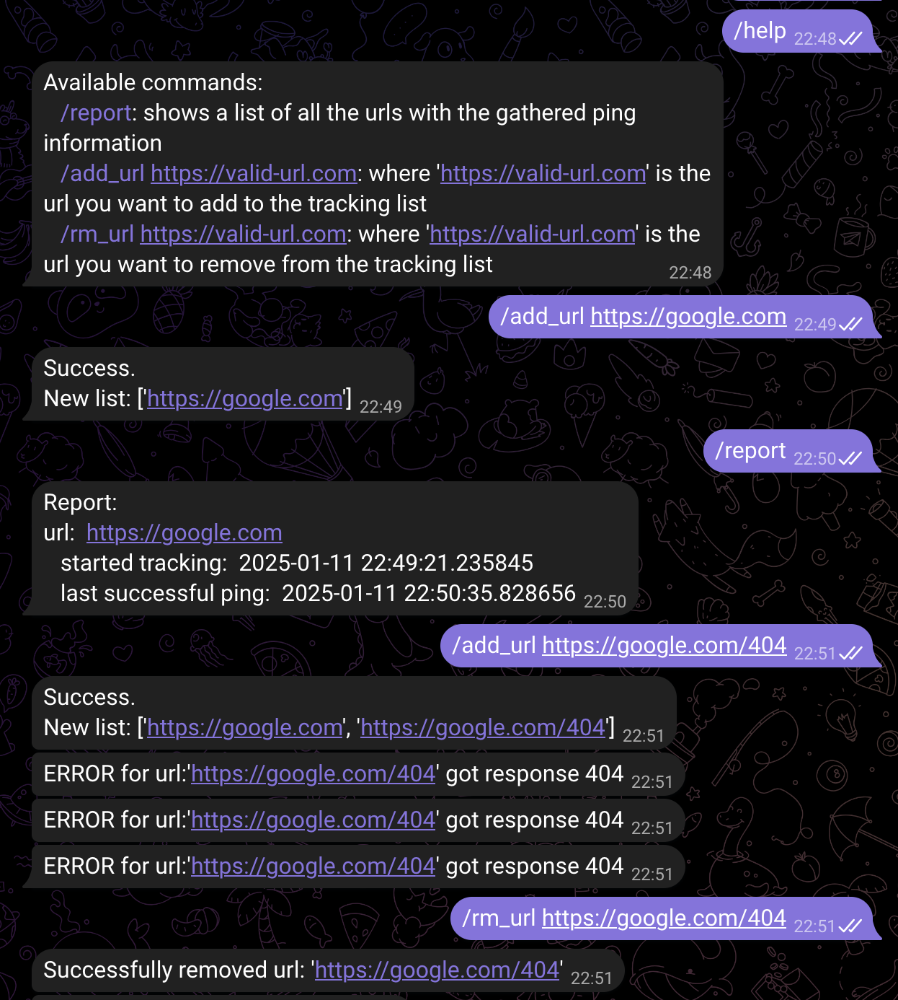

# Telegram ping bot
Simple telegram bot to check if the user-provided URLs are returning 200 OK responses.

If a URL returns something other than 200, a recurring error is sent to all active chats.

## Execution showcase


## Dependencies
```sh
pip install validators
pip install requests
pip install python-telegram-bot
pip install "python-telegram-bot[job-queue]"
```

## Execution steps
- Install the [listed dependencies](#dependencies)
- Obtain a token from the [Telegram BotFather](https://t.me/botfather)
- Use the token to fill the `token` variable inside the `main` method 
- Run the `main.py` script
- Talk to the bot

Note that you need the `main.py` script to be running for the bot to be functional.